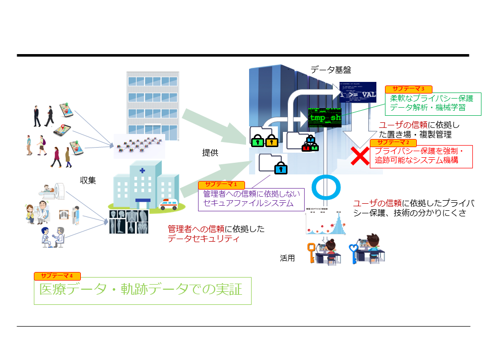

# [実応用に即したプライバシー保護解析とセキュアデータ基盤](https://www.jst.go.jp/kisoken/crest/project/1111114/1111114_2021.html)
# [Privacy-Preserving Data Analysis and Secure Data Infrastructure for Real Applications](https://www.jst.go.jp/kisoken/crest/project/1111114/1111114_2021.html)

## 目標

不正侵入によるデータの漏洩, 正当なユーザによるデータの持ち出し, 解析結果からの(故意または過失による)個人の特定, などの懸念を払拭, 軽減する, システムソフトウェア(データ基盤, OS), データ解析(差分プライバシー, 連合学習), 実応用(医療データ, 軌跡データ活用)の研究を一体的に進め, 安全に積極的なデータ活用可能なSociety 5.0の実現に貢献することを目指します.

本プロジェクトはJST CREST [「基礎理論とシステム基盤技術の融合によるSociety 5.0のための基盤ソフトウェアの創出」](https://www.jst.go.jp/kisoken/crest/research_area/ongoing/bunya2021-2.html) 領域に採択されています.

## 体制

* 代表
 * [田浦健次朗](https://www.eidos.ic.i.u-tokyo.ac.jp/~tau/) 東京大学大学院 [情報理工学系研究科](https://www.i.u-tokyo.ac.jp/) [電子情報学専攻](https://www.i.u-tokyo.ac.jp/edu/course/ice/index.shtml) 
* 主たる研究分担者
 * [吉川正俊](https://www.db.soc.i.kyoto-u.ac.jp/~yoshikawa/) 京都大学大学院 [情報学研究科](https://www.i.kyoto-u.ac.jp/) [社会情報学専攻](https://www.soc.i.kyoto-u.ac.jp/)
 * 花岡昇平 東京大学 [附属病院](https://www.h.u-tokyo.ac.jp/) [放射線科](http://www.ut-radiology.umin.jp/) 
 * [塙敏博](https://www.cspp.cc.u-tokyo.ac.jp/hanawa/) 東京大学 [情報基盤センター](https://www.itc.u-tokyo.ac.jp/) 
 * [曹洋](https://yangcao88.github.io/) 北海道大学 [情報科学研究院](https://www.ist.hokudai.ac.jp/) [情報理工学部門](https://www.csit.ist.hokudai.ac.jp/)
* 共同研究者
 * ...

## 研究内容

 * 医用データ(診断画像, 電子カルテ, レセプトデータ), 人や物の位置情報データなど, 有用なデータの多くが個人情報に基づいています
 * それらのデータは通常, 個人の識別に必要な情報は除去(仮名化, ハッシング)された上で提供され, かつ目的としても, 機械学習のモデル構築(例: 大量の正常画像, 病理画像を用いて, 画像診断のモデルを構築する)や, 統計的なデータの計算(例: 期間ごと, 施設ごとの利用者数を算出する)など, 個人情報を露呈しない用途で利用されることがほとんどです
 * そうであっても, 個人情報を元にした解析結果(機械学習モデルや統計データ)と, 個人に対する外部知識を組み合わせて個人の情報を特定しうることが知られており(...), 個人情報を妥当な目的で提供・利用するにあたっての障壁になっています
 * また現在用いられているファイルシステムやクラウドストレージではデータの提供 $=$ データの読み出し権限を与える, ということであり, 読み出されたデータのコピー・流出をシステムによって制御することが困難であり, これもまた, データ提供の障壁となっています
 * これらの問題を解決するためには, 読み出したデータを外部に流出(出力)できないことを保証するシステム, 個人の情報を特定しうる結果を出力できないことを保証するシステムなど新しいシステム技術が必要です
 * それと並立するアプローチとして, データそのものをより匿名化し, 個人情報の復元を不可能にするという方法もあります(K匿名化やローカル差分プライバシなど)が, データの有用性が著しく損なわれるという問題があります
 * 本研究ではこれらの問題を解決するために様々なレイヤ(基盤ソフトウェア, アルゴリズムの枠組み, 実応用)で取り組みます
 * 具体的には以下のモジュールに分解し, 連携して取り組みます(すべて進行中の研究であり, 目標やアプローチの変更がありえます)
 
 1. 管理者への信頼に依拠しないセキュアファイルシステム 
 1. プライバシー保護を強制・追跡可能なシステム機構
 1. 柔軟なプライバシー保護データ解析・機械学習 
 1. 医療・軌跡データ実応用での実証 
 
## 管理者への信頼に依拠しないセキュアファイルシステム 

## プライバシー保護を強制・追跡可能なシステム機構

 * このサブテーマでは, 個人情報を特定する解析結果の出力を抑止するためのシステム, --- 具体的にはプログラミング言語処理系 --- について研究する
 * 解析結果から個人情報を特定できないようにするための仕組みとして, (グローバル)差分プライバシーの枠組みを活用する
 * グローバル差分プライバシーの枠組みでは, 解析結果(多数の個人データの平均や和など)に確率的なノイズを加えることにより, 解析結果に対する特定個人の寄与を曖昧にし, 結果として解析結果から個人のデータが導き出されることを防ぐ
 * 目指す言語処理系では,
   * 個人の情報に基づくデータ(ファイルやデータベースからの入力を想定), およびそこから計算によって派生したデータは出力を禁止する,
   * 適切なグローバル差分プライバシー機構を通した(確率的なノイズを加えた)データのみ出力を許可する
ことによりプライバシー漏洩を防止する

## 柔軟なプライバシー保護データ解析・機械学習 

## 医療・軌跡データ実応用での実証 

